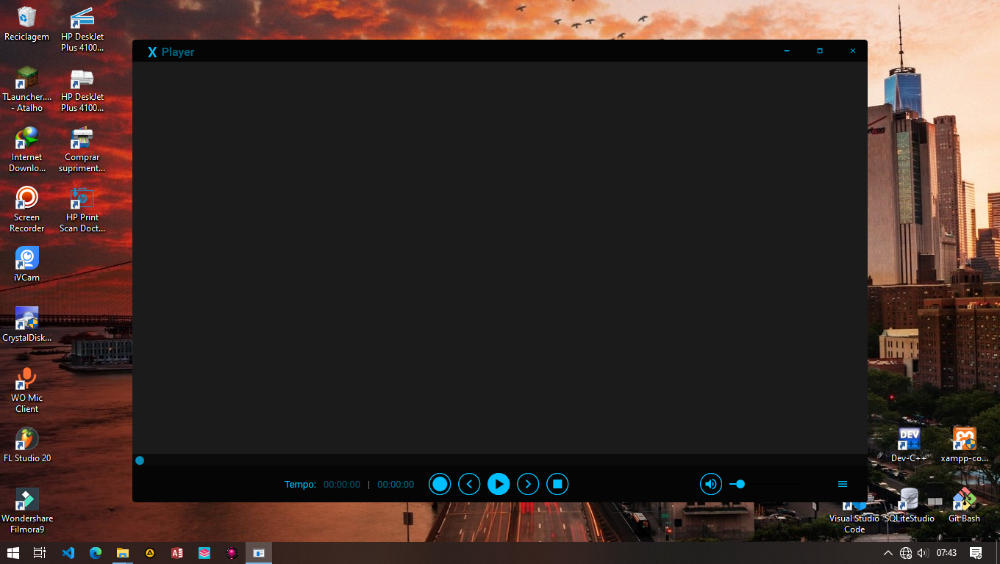
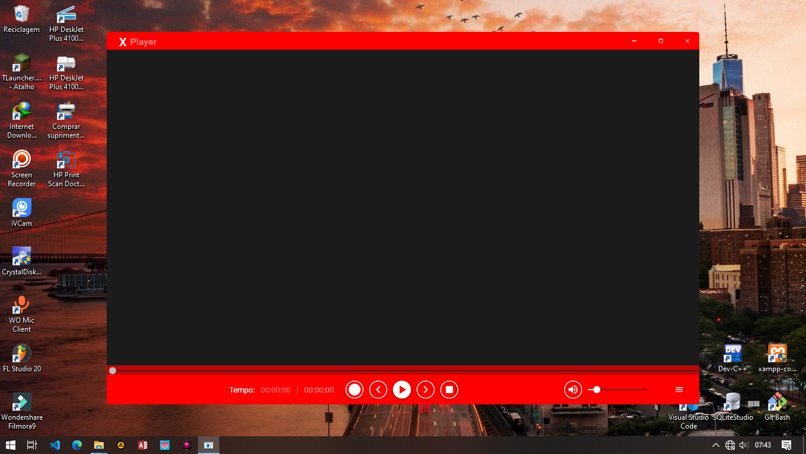
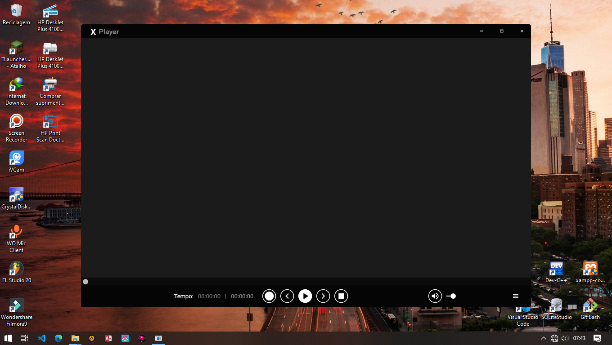
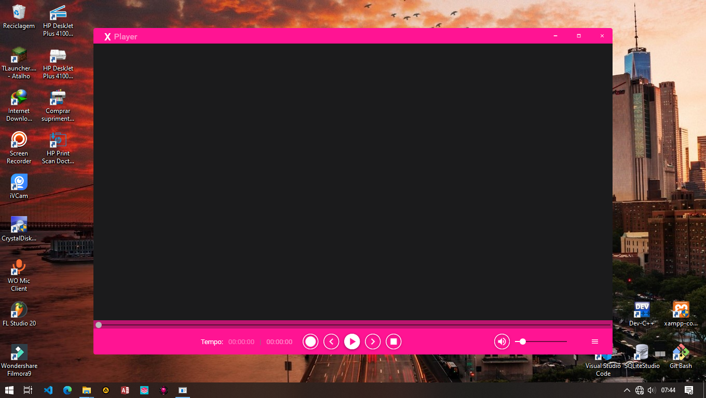
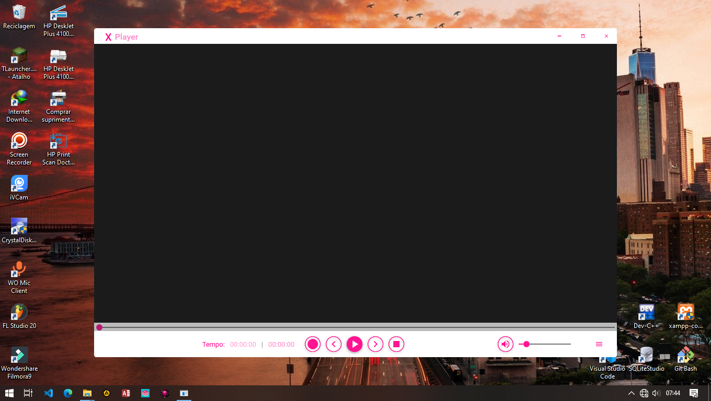

# XPlayer Reprodutor de Vídeo

Bem-vindo ao XPlayer, um reprodutor de vídeo incrível desenvolvido em C# WPF com design moderno utilizando o Material Design.

## Temas

Aqui estão alguns dos temas disponíveis no XPlayer:

1. 
2. 
3. 
4. 
5. 
6. 
7. 
8. 
9. 
10. 
11. 
## Contribuições

Contribuições são bem-vindas! Sinta-se à vontade para abrir issues ou pull requests.
